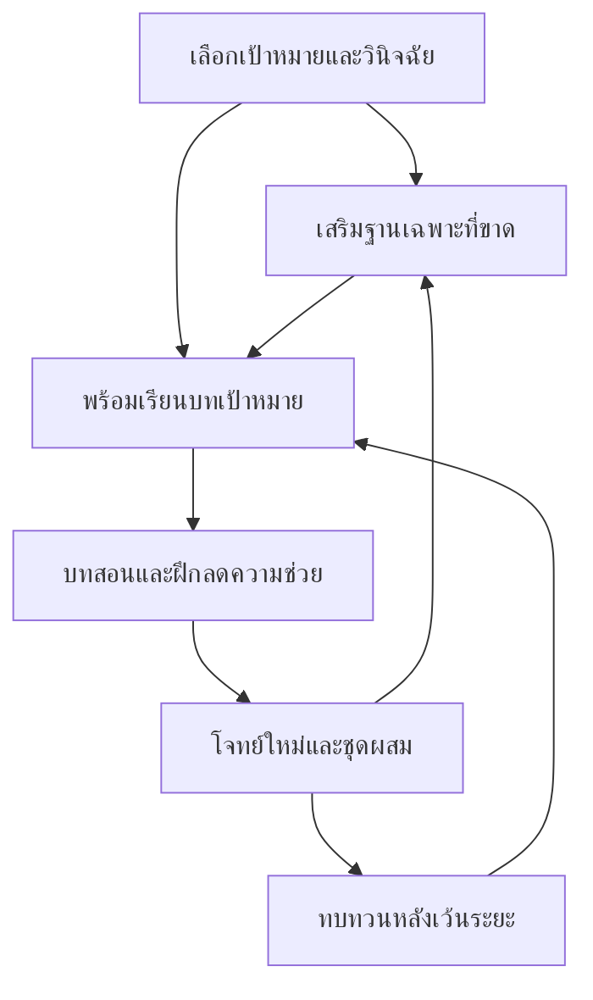

# ผังฐานความรู้และเส้นทางเตรียมสอบ

9 ตุลาคม 2026 · ผังออกแบบฉบับ0.1 · ไม่ใช่หลักสูตรที่ผลิตบทเรียนครบแล้ว

## แหล่งและวิธีอ่านผัง

ตรวจ [คู่มือ สสวท. ม.ต้น](https://www.scimath.org/e-books/8380/8380.pdf), [ม.ปลาย](https://www.scimath.org/e-books/8379/8379.pdf), [Blueprint Math1](https://www.mytcas.com/blueprint/a-level-61-math1/) และ [Math2](https://www.mytcas.com/blueprint/a-level-62-math2/) เมื่อ9ตุลาคม2026 รหัสF/L/Uเป็นรหัสโครงการ ไม่ใช่ตัวชี้วัดของกระทรวง ลำดับพื้นฐานและหลักฐานเป็นข้อเสนอการสอนของโครงการ ตารางนี้แยกขอบเขตบทกับผลสอบจริง ไม่ประกาศว่าทุกเรื่องมีความถี่เท่ากัน

ยังไม่จับคู่ตัวชี้วัดรายทักษะครบทุกเรื่อง เริ่มเชื่อมได้อย่างตรวจย้อนกลับสองรายการ: ค่าเฉลี่ยกับผลรวมเป็นส่วนหนึ่งของ ค3.1 ม.2/1 (คู่มือม.ต้นหน้าพิมพ์23) และ ค3.1 ม.6/1 (คู่มือม.ปลายหน้าพิมพ์17) ตรวจตารางจากภาพแล้ว หน่วยค่าเฉลี่ยไม่ได้ครอบคลุมตัวชี้วัดทั้งข้อ เพราะยังไม่ได้สอนตัวแทนข้อมูล/ค่ากลางชนิดอื่นและการกระจายครบ ไม่ตีความว่าผ่านหน่วยเดียวเท่ากับผ่านตัวชี้วัด

## ฐานร่วมที่วินิจฉัยก่อนเลือกบท

| รหัส | ทักษะ / ความรู้ก่อนเรียน | หลักฐานที่ควรตรวจ | ทางเดินต่อ |
| --- | --- | --- | --- |
| F01 | จำนวน เครื่องหมาย เศษส่วน ทศนิยม; การคำนวณพื้นฐาน | คำนวณและประมาณค่า ตรวจขนาดคำตอบ | อัตราส่วน สมการ สถิติ |
| F02 | อัตราส่วน สัดส่วน ร้อยละ; F01 | ระบุฐานและหน่วย แปลกลับข้อความ | ความคล้าย ต้นทุน ความน่าจะเป็น |
| F03 | หน่วยและการวัด; F01 | แปลงหน่วย แยกความยาว/พื้นที่/ปริมาตร | เรขาคณิตและโจทย์ประยุกต์ |
| F04 | นิพจน์ ตัวแปร สมการ; F01 | กำหนดตัวแปรและตรวจแทนกลับ | ฟังก์ชัน ระบบสมการ แบบจำลอง |
| F05 | อ่านรูป กราฟ ตาราง; F01/F03ตามบริบท | แยกข้อมูลที่ให้จากค่าที่คาดจากภาพ | ทุกสายที่ใช้ตัวแทนข้อมูล |
| F06 | เงื่อนไขและเหตุผล; เช็กภาษาโจทย์ | แยกสิ่งที่ต้องหา เงื่อนไข และเหตุผลเลือกวิธี | ทุกสาย ไม่ใช่บทที่ต้องผ่านครั้งเดียวแล้วจบ |

เลือกเส้นทาง ม.4 หรือมหาวิทยาลัยก่อน ไม่บังคับผู้เตรียม ม.4 เรียนแคลคูลัส ไม่ถือว่าเรียน Math2 จบแล้วครอบคลุม Math1

## เส้นทางสอบเข้า ม.4

เป็นฐานหลักสูตร ม.1–ม.3 สำหรับเตรียมเรียน/สอบ ยังไม่ใช่ขอบเขตสอบรับรองของโรงเรียนใด ต้องเติมหลักฐานข้อสอบโรงเรียนเมื่อหาได้

| กลุ่ม | หัวข้อที่จะต้องแตกเป็นบท | พื้นฐานหลัก | หลักฐานปลายกลุ่ม |
| --- | --- | --- | --- |
| L01 จำนวน | จำนวนจริง ราก เลขยกกำลัง | F01 | เลือกสมบัติและตรวจเงื่อนไขตัวเลข |
| L02 พีชคณิต | พหุนาม แยกตัวประกอบ สมการ/อสมการ ระบบสมการ กำลังสอง | F04,L01 | สร้างสมการจากข้อความและตรวจคำตอบ |
| L03 กราฟ | ความสัมพันธ์เชิงเส้นและฟังก์ชันกำลังสอง | F04,F05,L02ตามบท | เชื่อมสูตร ตาราง กราฟ และความหมาย |
| L04 การวัด | พื้นที่ผิว ปริมาตร หน่วย รูปทรง | F03,F05 | อธิบายสูตรและหน่วย เลือกข้อมูลจำเป็น |
| L05 เรขาคณิต | การสร้าง การแปลง เส้นขนาน เท่ากันทุกประการ พีทาโกรัส ความคล้าย วงกลม | F02,F05,L01 | ให้เหตุผลจากสมบัติ ไม่วัดรูปเพื่อแทนพิสูจน์ |
| L06 ตรีโกณมิติพื้นฐาน | อัตราส่วนในสามเหลี่ยมมุมฉาก | F02,L05 | จับด้านกับมุมและตรวจช่วงค่า |
| L07 ข้อมูล | คำถาม/การเก็บข้อมูล การนำเสนอ ค่ากลาง แผนภาพกล่อง | F01,F05 | คำนวณพร้อมแปลความหมายและบอกข้อจำกัด |
| L08 ความน่าจะเป็น | การทดลองสุ่ม เหตุการณ์ โอกาสเกิด | F01,F02,F06 | แสดงกรณีและตรวจว่าสมมติฐานเหมาะสม |

เรื่องเสริมที่อาจพบในแนวโจทย์ เช่นปัญหาจำนวนเฉพาะหรือการนับที่ซับซ้อน ให้จัดเป็นextensionหลังตรวจแหล่ง ไม่อ้างว่าเป็นตัวชี้วัดแกนกลางปัจจุบันเพียงเพราะหนังสือเก็งมีเรื่องนั้น

## เส้นทางมหาวิทยาลัย: เลือก Math2 หรือ Math1

หัวข้อด้านล่างจับกับBlueprintระดับหมวดแล้ว การกำหนดพื้นฐานและหลักฐานรายกลุ่มเป็นงานออกแบบของโครงการ หน้าBlueprintไม่มีน้ำหนักรายบทละเอียด จึงไม่แต่งเปอร์เซ็นต์รายเรื่อง

| รหัส | กลุ่ม / พื้นฐาน | Math2 | Math1 | ข้อ Math1 ปี2568ที่ใช้เป็นตัวอย่างวิเคราะห์ |
| --- | --- | --- | --- | --- |
| U01 | เซต/ตรรกศาสตร์; F06 | เซตและตรรกศาสตร์เบื้องต้น | เซตและตรรกศาสตร์ | 1,2,29 |
| U02 | เลขยกกำลัง/จำนวน/พหุนาม; F01,F04,L01–02 | เลขยกกำลัง | จำนวนจริง พหุนาม เอกซ์โพเนนเชียล ลอการิทึม | 3,5 |
| U03 | ฟังก์ชัน; F04,F05,L03 | ฟังก์ชันตามขอบเขตพื้นฐาน | ฟังก์ชันและฟังก์ชันประกอบ/โดเมน | 4,6 |
| U04 | ลำดับ/อนุกรม/ดอกเบี้ย; F01,F02,F04 | มี | มีลำดับ/อนุกรม; ดอกเบี้ยสัมพันธ์กับโจทย์ประยุกต์ | 10,12,28 |
| U05 | การนับ/ความน่าจะเป็น; F02,F06 | มี | มี รวมการแจกแจงเบื้องต้น | 17,18,20,21,30 |
| U06 | สถิติ; F01,F05,L07 | มี | มี รวมการแจกแจงเบื้องต้นตามขอบเขต | 19,22 |
| U07 | ตรีโกณมิติ; F02,L05–06 | ไม่อยู่ในรายการหัวข้อBlueprint Math2ที่ตรวจ | มี | 7,26 |
| U08 | เมทริกซ์/จำนวนเชิงซ้อน; F04,L02 | ไม่อยู่ในรายการ Math2 | มี | 8,9,27 |
| U09 | เรขาคณิตวิเคราะห์/เวกเตอร์; F03,F04,F05,L05 | ไม่อยู่ในรายการ Math2 | มี | 13,14,15,16 |
| U10 | แคลคูลัส; U03และพื้นฐานพีชคณิต | ไม่อยู่ในรายการ Math2 | มี | 23,24,25 |

ข้อ11เป็นทักษะอสมการ/ค่าสัมบูรณ์ของสายU02/U03 หมวดในตารางไม่ใช่การแบ่งข้อแบบไม่ทับกัน การจับข้อกับทักษะรองทำได้หลายกลุ่ม ไม่ใช้ผลรวมจำนวนข้อแต่ละแถวเป็นสถิติความถี่โดยไม่ตัดซ้ำ

หลักฐานปลายสาย: เลือกวิธีโดยไม่มีชื่อบทบอกใบ้ อธิบายเงื่อนไข ตรวจคำตอบ และทำโจทย์คนละตระกูลได้ การใช้คำใบ้ในการฝึกช่วยเรียนได้แต่ต้องแยกจากผลซ้อมสอบ

## ลำดับเรียนแบบแตกแขนง

ตัวอย่าง: ผู้เรียนคำนวณค่าเฉลี่ยได้แต่รวมกลุ่มผิด ให้เรียนผลรวม/จำนวนและน้ำหนักกลุ่ม ไม่ย้อนคณิตทั้งระดับ; ผู้ทำสมการถูกแต่ตีความราคาเป็นจำนวนที่เพิ่มผิด ให้เสริมการกำหนดตัวแปรและตรวจจุดตั้งต้น

## สถานะและลำดับผลิต

1. ผลิตและทดลองหน่วยค่าเฉลี่ยที่มีร่างครบก่อน ใช้โครงAVG01–05เป็นทักษะย่อยของL07/U06 ไม่ต้องทำบทซ้ำสองชุดทั้งหมด ปรับความลึกโจทย์ตามเส้นทาง
2. ผลิตหน่วยอัตราส่วน/ร้อยละและสมการตามช่องว่างวินิจฉัย เพื่อเป็นฐานร่วม ไม่อ้างว่าเป็นบทออกสอบสูงสุด
3. เพิ่มบทเป้าหมายจากข้อที่ตรวจจริงและผลทดลอง; สำหรับ ม.4 ต้องมีทะเบียนแหล่งของตัวเอง
4. เติมตารางรายทักษะ→รหัสตัวชี้วัด/ผลการเรียนรู้→หน้าอ้างอิง→ข้อสอบ→บทสอน→ข้อประเมิน→ผู้ตรวจให้ครบ ก่อนประกาศหลักสูตรพร้อม

เวลาแต่ละกลุ่มและจำนวนบททั้งหลักสูตรยังไม่กำหนดถาวร ต้องรู้พื้นฐานผู้เรียนและผลทดลองก่อน ไม่มีเควสหรือระบบเศรษฐกิจใหม่ในผังนี้
